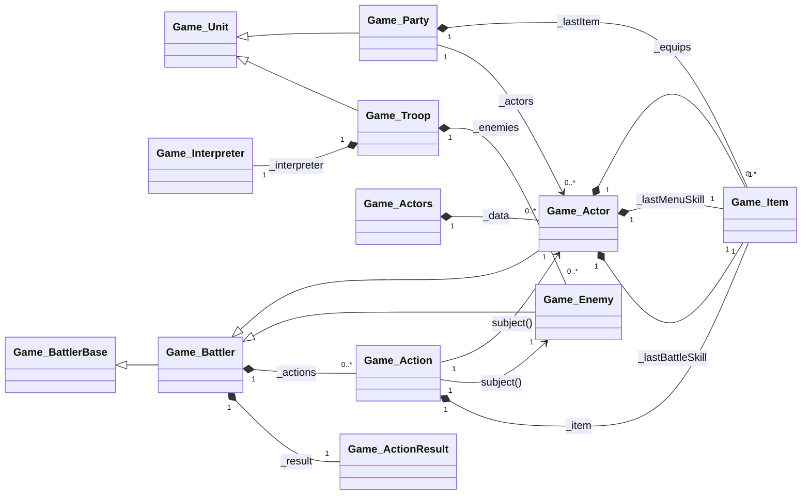

```mermaid
classDiagram
direction LR
Game_Unit<|--Game_Party
Game_Unit<|--Game_Troop
Game_Interpreter"1"--*"1"Game_Troop:_interpreter
Game_Party"1"*--"1"Game_Item:_lastItem
Game_Party"1"-->"0..*"Game_Actor:_actors
Game_Actors"1"*--"0..*"Game_Actor:_data
Game_BattlerBase<|--Game_Battler
Game_Battler<|--Game_Actor
Game_Actor"1"*--"0..*"Game_Item:_equips
Game_Actor"1"*--"1"Game_Item:_lastMenuSkill
Game_Actor"1"*--"1"Game_Item:_lastBattleSkill
Game_Battler<|--Game_Enemy
Game_Battler"1"*--"0..*"Game_Action:_actions
Game_Action"1"-->"1"Game_Actor:subject()
Game_Action"1"-->"1"Game_Enemy:subject()
Game_Action"1"*--"1"Game_Item:_item
Game_Battler"1"*--"1"Game_ActionResult:_result
Game_Troop"1"*--"0..*"Game_Enemy:_enemies
```
