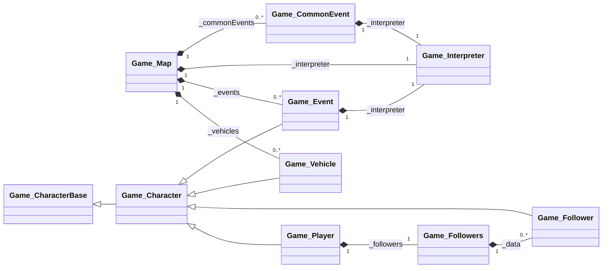

```mermaid
classDiagram
direction LR
Game_Map"1"*--"0..*"Game_Vehicle:_vehicles
Game_Map"1"*--"0..*"Game_Event:_events
Game_Map"1"*--"1"Game_Interpreter:_interpreter
Game_Map"1"*--"0..*"Game_CommonEvent:_commonEvents
Game_CommonEvent"1"*--"1"Game_Interpreter:_interpreter
Game_CharacterBase<|--Game_Character
Game_Character<|--Game_Player
Game_Character<|--Game_Follower
Game_Character<|--Game_Vehicle
Game_Character<|--Game_Event
Game_Event"1"*--"1"Game_Interpreter:_interpreter
Game_Player"1"*--"1"Game_Followers:_followers
Game_Followers"1"*--"0..*"Game_Follower:_data
%%Game_Interpreter"1"*--"1"Error
%%Game_Interpreter"1"*--"1"Game_Interpreter:_childInterpreter
```
