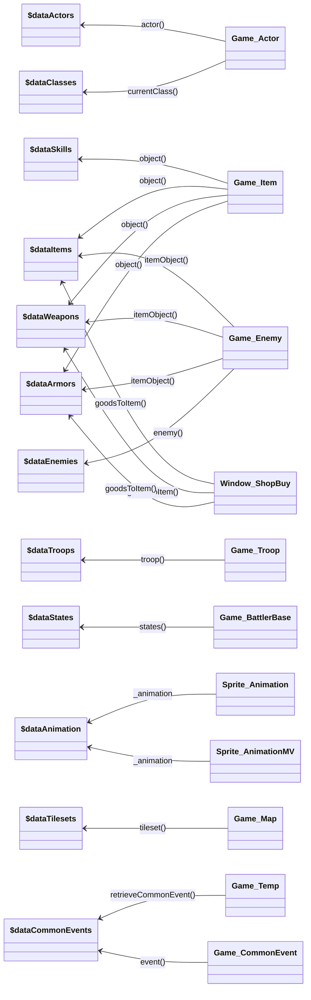

|Variable Name|Filename|Path on your editor|
|---|---|---|
|$dataActors|Actors.json|Database > Actors|
|$dataClasses|Classes.json|Database > Classes|
|$dataSkills|Skills.json|Database > Skills|
|$dataItems|Items.json|Database > Items|
|$dataWeapons|Weapons.json|Database > Weapons|
|$dataArmors|Armors.json|Database > Armors|
|$dataEnemies|Enemies.json|Database > Enemies|
|$dataTroops|Troops.json|Database > Troops|
|$dataStates|States.json|Database > States|
|$dataAnimations|Animations.json|Database > Animations|
|$dataTilesets|Tilesets.json|Database > Tilesets|
|$dataCommonEvents|CommonEvents.json|Database > Common Events|
|$dataSystem|System.json|Database > System 1/2|
|$dataMapInfos|MapInfos.json|Database > MapInfos|

