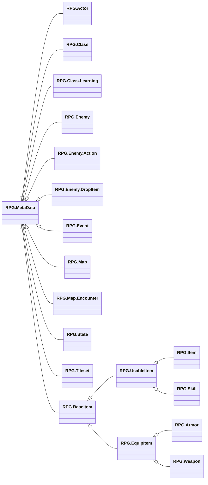

```mermaid
classDiagram
direction LR
`RPG.Animation`
`RPG.Animation.Timing`
`RPG.AudioFile`
`RPG.BattleEventPage`
`RPG.BattleEventPage.Conditions`
`RPG.CommonEvent`
`RPG.Damage`
`RPG.Effect`
`RPG.EventCommand`
`RPG.EventPage`
`RPG.EventPage.Conditions`
`RPG.EventPage.Image`
`RPG.MapInfo`
`RPG.MoveCommand`
`RPG.MoveRoute`
`RPG.System`
`RPG.System.Advanced`
`RPG.System.titleCommandWindow`
`RPG.System.AttackMotion`
`RPG.System.Terms`
`RPG.System.TestBattler`
`RPG.System.Vehicle`
`RPG.Trait`
`RPG.Troop`
`RPG.Troop.Member`
`RPG.MetaData`<|--`RPG.Actor`
`RPG.MetaData`<|--`RPG.Class`
`RPG.MetaData`<|--`RPG.Class.Learning`
`RPG.MetaData`<|--`RPG.Enemy`
`RPG.MetaData`<|--`RPG.Enemy.Action`
`RPG.MetaData`<|--`RPG.Enemy.DropItem`
`RPG.MetaData`<|--`RPG.Event`
`RPG.MetaData`<|--`RPG.Map`
`RPG.MetaData`<|--`RPG.Map.Encounter`
`RPG.MetaData`<|--`RPG.State`
`RPG.MetaData`<|--`RPG.Tileset`
`RPG.MetaData`<|--`RPG.BaseItem`
`RPG.BaseItem`<|--`RPG.UsableItem`
`RPG.UsableItem`<|--`RPG.Item`
`RPG.UsableItem`<|--`RPG.Skill`
`RPG.BaseItem`<|--`RPG.EquipItem`
`RPG.EquipItem`<|--`RPG.Armor`
`RPG.EquipItem`<|--`RPG.Weapon`
```
