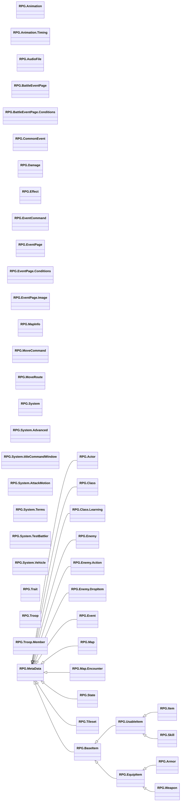

```mermaid
classDiagram
direction LR
class `RPG.Animation`
class `RPG.Animation.Timing`
class `RPG.AudioFile`
class `RPG.BattleEventPage`
class `RPG.BattleEventPage.Conditions`
class `RPG.CommonEvent`
class `RPG.Damage`
class `RPG.Effect`
class `RPG.EventCommand`
class `RPG.EventPage`
class `RPG.EventPage.Conditions`
class `RPG.EventPage.Image`
class `RPG.MapInfo`
class `RPG.MoveCommand`
class `RPG.MoveRoute`
class `RPG.System`
class `RPG.System.Advanced`
class `RPG.System.titleCommandWindow`
class `RPG.System.AttackMotion`
class `RPG.System.Terms`
class `RPG.System.TestBattler`
class `RPG.System.Vehicle`
class `RPG.Trait`
class `RPG.Troop`
class `RPG.Troop.Member`
`RPG.MetaData`<|--`RPG.Actor`
`RPG.MetaData`<|--`RPG.Class`
`RPG.MetaData`<|--`RPG.Class.Learning`
`RPG.MetaData`<|--`RPG.Enemy`
`RPG.MetaData`<|--`RPG.Enemy.Action`
`RPG.MetaData`<|--`RPG.Enemy.DropItem`
`RPG.MetaData`<|--`RPG.Event`
`RPG.MetaData`<|--`RPG.Map`
`RPG.MetaData`<|--`RPG.Map.Encounter`
`RPG.MetaData`<|--`RPG.State`
`RPG.MetaData`<|--`RPG.Tileset`
`RPG.MetaData`<|--`RPG.BaseItem`
`RPG.BaseItem`<|--`RPG.UsableItem`
`RPG.UsableItem`<|--`RPG.Item`
`RPG.UsableItem`<|--`RPG.Skill`
`RPG.BaseItem`<|--`RPG.EquipItem`
`RPG.EquipItem`<|--`RPG.Armor`
`RPG.EquipItem`<|--`RPG.Weapon`
```
