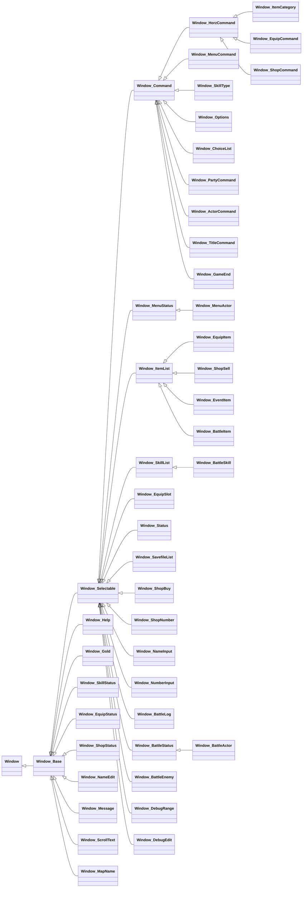

```mermaid
classDiagram
direction LR
Window<|--Window_Base
Window_Base<|--Window_Selectable
Window_Selectable<|--Window_Command
Window_Command<|--Window_HorzCommand
Window_Base<|--Window_Help
Window_Base<|--Window_Gold
Window_Command<|--Window_MenuCommand
Window_Selectable<|--Window_MenuStatus
Window_MenuStatus<|--Window_MenuActor
Window_HorzCommand<|--Window_ItemCategory
Window_Selectable<|--Window_ItemList
Window_Command<|--Window_SkillType
Window_Base<|--Window_SkillStatus
Window_Selectable<|--Window_SkillList
Window_Base<|--Window_EquipStatus
Window_HorzCommand<|--Window_EquipCommand
Window_Selectable<|--Window_EquipSlot
Window_ItemList<|--Window_EquipItem
Window_Selectable<|--Window_Status
Window_Command<|--Window_Options
Window_Selectable<|--Window_SavefileList
Window_HorzCommand<|--Window_ShopCommand
Window_Selectable<|--Window_ShopBuy
Window_ItemList<|--Window_ShopSell
Window_Selectable<|--Window_ShopNumber
Window_Base<|--Window_ShopStatus
Window_Base<|--Window_NameEdit
Window_Selectable<|--Window_NameInput
Window_Command<|--Window_ChoiceList
Window_Selectable<|--Window_NumberInput
Window_ItemList<|--Window_EventItem
Window_Base<|--Window_Message
Window_Base<|--Window_ScrollText
Window_Base<|--Window_MapName
Window_Selectable<|--Window_BattleLog
Window_Command<|--Window_PartyCommand
Window_Command<|--Window_ActorCommand
Window_Selectable<|--Window_BattleStatus
Window_BattleStatus<|--Window_BattleActor
Window_Selectable<|--Window_BattleEnemy
Window_SkillList<|--Window_BattleSkill
Window_ItemList<|--Window_BattleItem
Window_Command<|--Window_TitleCommand
Window_Command<|--Window_GameEnd
Window_Selectable<|--Window_DebugRange
Window_Selectable<|--Window_DebugEdit
```
