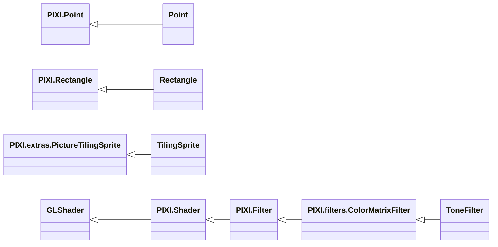
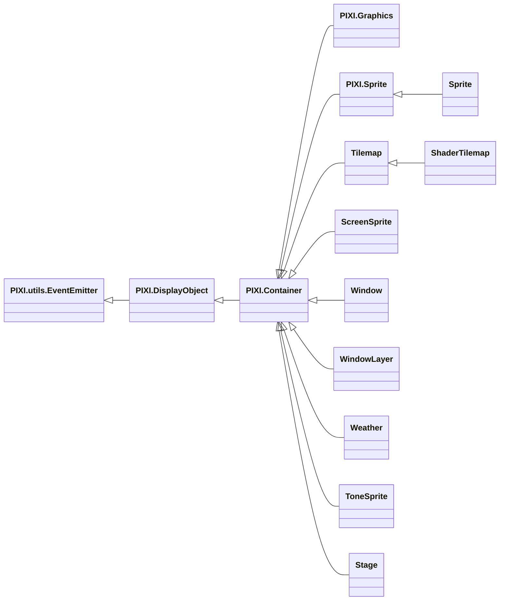

```mermaid
classDiagram
direction LR
`PIXI.Point`<|--Point
`PIXI.Rectangle`<|--Rectangle
`PIXI.extras.PictureTilingSprite`<|--TilingSprite
GLShader<|--PIXI.Shader
`PIXI.Shader`<|--PIXI.Filter
`PIXI.Filter`<|--PIXI.filters.ColorMatrixFilter
`PIXI.filters.ColorMatrixFilter`<|--ToneFilter
```

```mermaid
classDiagram
direction LR
`PIXI.utils.EventEmitter`<|--PIXI.DisplayObject
`PIXI.DisplayObject`<|--PIXI.Container
`PIXI.Container`<|--PIXI.Graphics
`PIXI.Container`<|--PIXI.Sprite
`PIXI.Sprite`<|--Sprite
`PIXI.Container`<|--Tilemap
Tilemap<|--ShaderTilemap
`PIXI.Container`<|--ScreenSprite
`PIXI.Container`<|--Window
`PIXI.Container`<|--WindowLayer
`PIXI.Container`<|--Weather
`PIXI.Container`<|--ToneSprite
`PIXI.Container`<|--Stage
```
