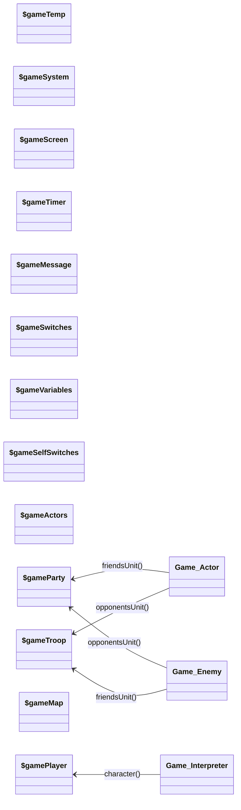

|Variable Name|Type|
|---|---|
|$gameTemp|Game_Temp|
|$gameSystem|Game_System|
|$gameScreen|Game_Screen|
|$gameTimer|Game_Timer|
|$gameMessage|Game_Message|
|$gameSwitches|Game_Switches|
|$gameVariables|Game_Variables|
|$gameSelfSwitches|Game_SelfSwitches|
|$gameActors|Game_Actors|
|$gameParty|Game_Party|
|$gameTroop|Game_Troop|
|$gameMap|Game_Map|
|$gamePlayer|Game_Player|

