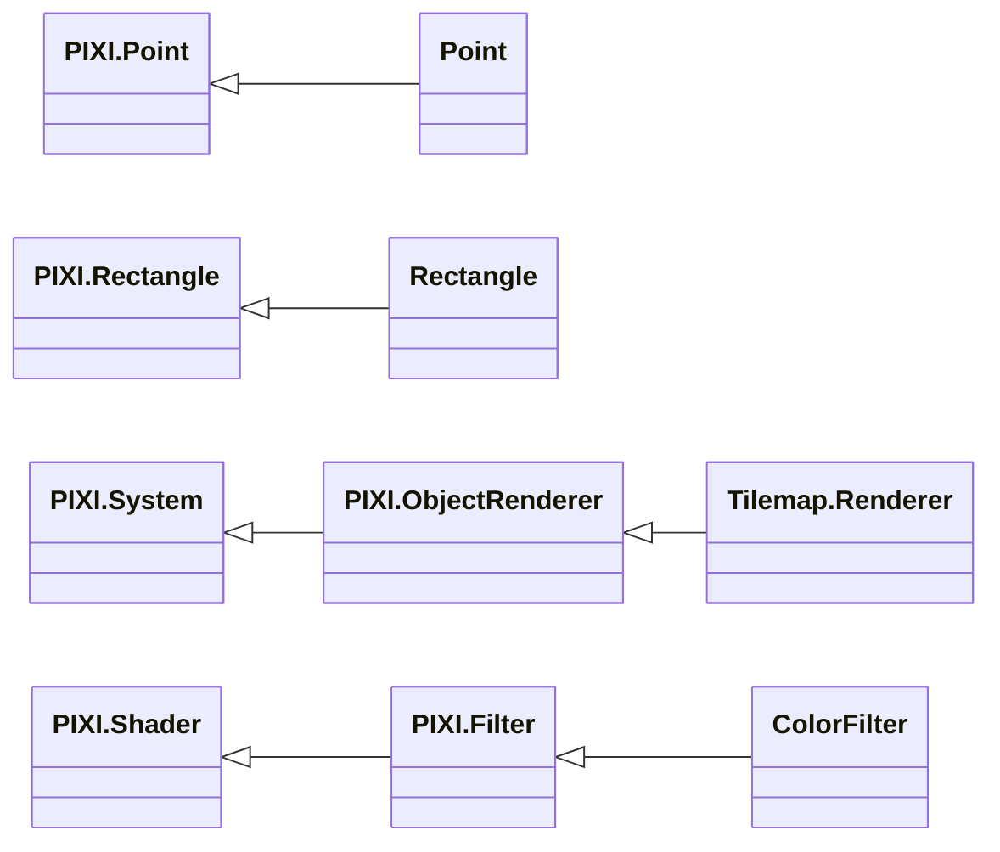
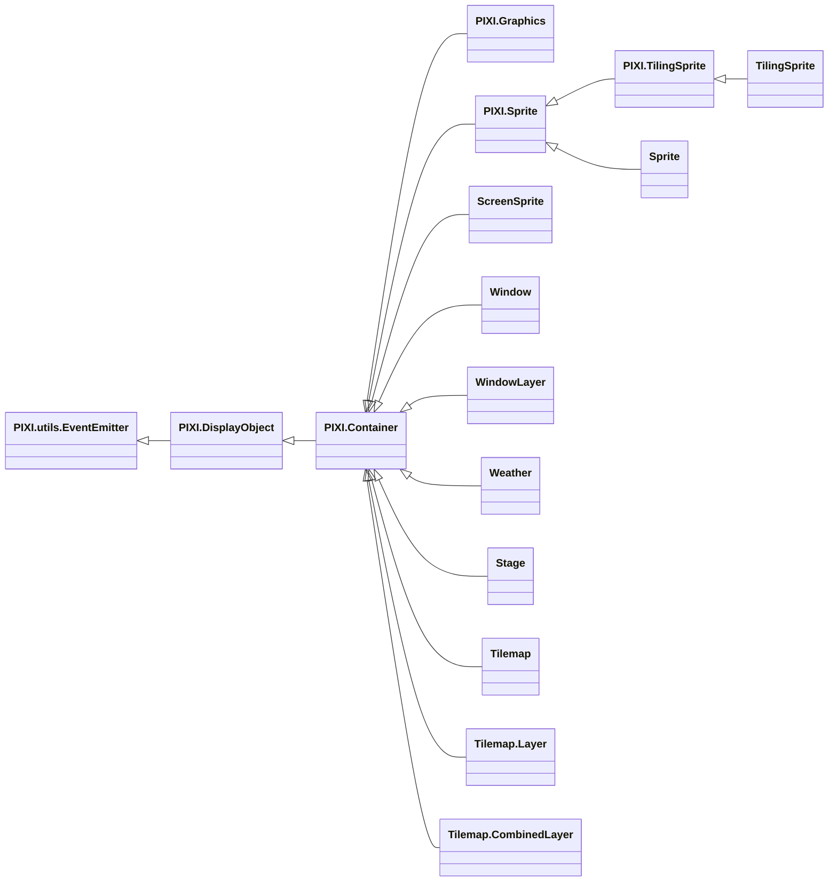

```mermaid
classDiagram
direction LR
`PIXI.Point`<|--Point
`PIXI.Rectangle`<|--Rectangle
`PIXI.System`<|--PIXI.ObjectRenderer
`PIXI.ObjectRenderer`<|--`Tilemap.Renderer`
`PIXI.Shader`<|--PIXI.Filter
`PIXI.Filter`<|--ColorFilter
```

```mermaid
classDiagram
direction LR
`PIXI.utils.EventEmitter`<|--PIXI.DisplayObject
`PIXI.DisplayObject`<|--PIXI.Container
`PIXI.Container`<|--PIXI.Graphics
`PIXI.Container`<|--PIXI.Sprite
`PIXI.Sprite`<|--PIXI.TilingSprite
`PIXI.TilingSprite`<|--TilingSprite
`PIXI.Sprite`<|--Sprite
`PIXI.Container`<|--ScreenSprite
`PIXI.Container`<|--Window
`PIXI.Container`<|--WindowLayer
`PIXI.Container`<|--Weather
`PIXI.Container`<|--Stage
`PIXI.Container`<|--Tilemap
`PIXI.Container`<|--`Tilemap.Layer`
`PIXI.Container`<|--`Tilemap.CombinedLayer`
```
